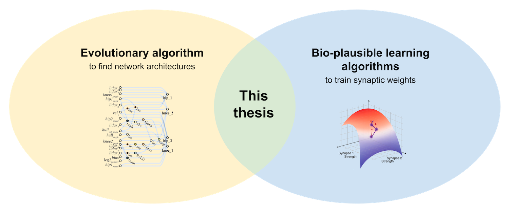

# Biologically Plausible Deep Learning through Neuroevolution

This is the code for my master thesis at TU Berlin and BCCN Berlin. 

It combines an evolutionary approach with different learning algorithms 
(backpropagation, feedback alignment, Hebbian learning, last-layer learning) 
on MNIST. You can read the complete thesis 
[here](master-thesis-johannes-rieke-final.pdf). 

## Abstract

Recently, deep learning has been increasingly used as a framework to understand 
information processing in the brain. Most existing research in this area has 
focused on finding biologically plausible learning algorithms. In this thesis, 
we investigate how the architecture of a neural network interacts with such 
learning algorithms. Inspired by the intricate wiring of biological brains, we 
use an evolutionary algorithm to develop network architectures by mutating 
neurons and connections. Within the evolution loop, the synaptic weights of the 
networks are trained with one of four learning algorithms, which vary in 
complexity and biological plausibility (backpropagation, feedback alignment, 
Hebbian learning, last-layer learning). We investigate how the evolved network 
architectures differ between learning algorithms, both in terms of their 
performance on image classification with MNIST as well as their topologies. We 
show that for all learning algorithms, the evolved architectures learn much 
better than random networks – i.e. evolution and learning interact. Also, we 
find that more complex learning algorithms (e.g. backpropagation) can make use 
of larger, deeper, and more densely connected networks, which achieve higher 
performances. For simpler and biologically more plausible learning algorithms 
(e.g. Hebbian learning), however, the evolution process prefers smaller 
networks. Our results demonstrate that the architecture of a neural network 
plays an important role in its ability to learn. Using a range of learning 
algorithms, we show that evolutionary processes can find architectures of 
artificial neural networks that are particularly suited for learning – similar 
to how biological evolution potentially shaped the complex wiring of neurons 
in the brain.

## Usage

Experiments are run like this:

    python run-wann-gym.py params/wann-gym/CartPoleSwingUp.yaml --num_workers 4

Let's analyze each part individually: 

`run-wann-gym.py` is the experiment script. This specific script evolves a 
weight agnostic neural network on a gym environment. The repo contains 4 
different experiment scripts:

- **run-wann-gym.py**: Evolve weight agnostic neural networks on gym 
environment. Works with any OpenAI gym; parameter files for CartPole-v0, 
CartPoleSwingUp and BipedalWalker-v2 are in the params folder (with the same 
parameter values as in Gaier & Ha 2019). 
- **run-wann-classification.py**: Evolve weight agnostic neural networks on an 
image classification dataset. Param files for sklearn digits and MNIST (same 
values as Gaier & Ha 2019) are given. 
- **run-wlnn-mnist.py**: Simultaneously evolve architecture of a network and 
train its weights on an image classification dataset, using one of several 
learning algorithms (evolution is outer loop and develops the architecture, 
training is inner loop and changes the weights). 
- **run-wlnn-mnist-no-evolution.py**: Train the weights of a neural network on 
an image classification dataset, using one of several learning algorithms 
(backprop, feedback alignment, Hebbian; no evolution!). 

`params/wann-gym/CartPoleSwingUp.yaml` is the parameter file in yaml format. 
This specific file defines parameters for the CartPoleSwingUp task as in Gaier 
& Ha (2019). The folder params contains many more parameter files.

`--num_workers 4` defines a parameter from the terminal (specifically, it tells 
the script to use 4 cores in parallel). You can define all parameters on the 
terminal as well as in parameter files. Terminal parameters overwrite the values 
from parameter files. See below for a complete list of parameters. 

## Log files

Log files for the experiments in the thesis are available in 
[this Google Drive folder](https://drive.google.com/drive/folders/1uoGx9glqYXKxW0OqW37F1IHJa2OxPHmx?usp=sharing). 
Each log is one folder, which contains a log file of the complete std output 
of the experiment, the experiment parameters, tensorboard files with lots of 
metrics, and (for some logs) all networks stored at regular intervals as json 
files.

For chapter 4.1 in the thesis (replicating weight agnostic neural 
networks):

- CartPoleSwingUp: [2019-11-30_02-34-46](https://drive.google.com/open?id=1r-Saxv-o6fl2OaowxPDOl3DOO0B-PNRE)
- BipedalWalker: [2019-12-01_22-18-42](https://drive.google.com/open?id=1FN4Ml7MjRyjD50wunRpvQsH1uumpiyVr)
- MNIST: [2019-11-28_23-42-24](https://drive.google.com/open?id=1CYBhBOOrQ2xUtFfXmm3lkHIHx66WL-x2)

For chapter 4.2 in the thesis (combining evolution and learning):

- Backpropagation on MNIST: [2020-01-17_16-08-55](https://drive.google.com/open?id=1Q1eaHus7JsFOYTp6q6P8q7KZQyrvDZOi)
- Feedback alignment on MNIST: [2020-01-17_03-02-27](https://drive.google.com/open?id=1rQOqCThtghdbRgDY9r3Vnl2p-CIbIqlK)
- Hebbian learning on MNIST: [2020-01-17_03-05-57](https://drive.google.com/open?id=1h5rJp4-08Wi1bzCbD7yLZYbhSJ7L4hIl)
- Last-layer learning on MNIST: [2020-01-17_03-08-48](https://drive.google.com/open?id=1CN3PMcKr9WleQU6THCOEH1RVNWHK-LGn)

## Parameters

Note that some of thes parameters only have an effect on specific scripts. 

    evolution options:
      --cull_ratio CULL_RATIO
                            Fraction of worst networks to leave out of the
                            breeding pool
      --elite_ratio ELITE_RATIO
                            Fraction of best networks to pass on to the new
                            population directly
      --num_generations NUM_GENERATIONS
                            Number of generations for evolution
      --population_size POPULATION_SIZE
                            Number of networks in the population
      --p_add_connection P_ADD_CONNECTION
                            Probability of adding a connection during mutation
      --p_add_node P_ADD_NODE
                            Probability of adding a node during mutation
      --p_change_activation P_CHANGE_ACTIVATION
                            Probability of changing the activation of a node
                            during mutation
      --tournament_size TOURNAMENT_SIZE
                            Number of networks that compete during tournament
                            selection
      --inherit_weights INHERIT_WEIGHTS
                            Keep weights after mutating a network
      --num_mutations_per_generation NUM_MUTATIONS_PER_GENERATION
                            The number of mutations to carry out at each
                            generation
      --p_complexity_objective P_COMPLEXITY_OBJECTIVE
                            The fraction of generations to rank according to
                            complexity and reward (otherwise only reward)
    
    evaluation options:
      --batch_size BATCH_SIZE
                            Batch size for evaluation (in run-wann-
                            classification.py) or learning (in run-wlnn-mnist-no-
                            evolution.py and run-wlnn-mnist.py)
      --batch_size_eval BATCH_SIZE_EVAL
                            Batch size for test set evaluation of learned networks
      --evaluation_period {integral,last_batch,last_ten_batches,first_ten_batches,last_epoch}
                            Which training period should be used to evaluate
                            networks. The options are: "integral" the mean across
                            the whole training duration, "last_batch" the values
                            in the final batch, "last_ten_batches" the values in
                            the last ten batches, "first_ten_batches" the values
                            in the first ten batches and "last_epoch" the values
                            averaged in the last epoch only.
      --num_trials NUM_TRIALS
                            How often to run the gym environment during evaluation
    
    training options:
      --learning_rule LEARNING_RULE
                            Learning rule to train network
      --lr LR               Learning rate
      --num_epochs NUM_EPOCHS
                            Number of epochs for learning
      --optimizer OPTIMIZER
                            Optimizer to train network (sgd, adam or adadelta)
      --train_only_outputs  If this option is selected, only the weights to the
                            output units will be learned. Else, all weights will
                            be learned.
    
    architecture options:
      --num_inputs NUM_INPUTS
                            Number of input neurons
      --num_outputs NUM_OUTPUTS
                            Number of output neurons
      --p_initial_connection_enabled P_INITIAL_CONNECTION_ENABLED
                            Probability of enabling a connection between input and
                            output layer at the start of evolution
    
    task and dataset options:
      params_file           A yaml file with parameters (see folder params for
                            examples)
      --dataset DATASET     Dataset for classification (digits or mnist)
      --env_name ENV_NAME   Name of the gym environment
    
    computational options:
      --num_workers NUM_WORKERS
                            Number of workers to run on
      --take_argmax_action TAKE_ARGMAX_ACTION
                            Use argmax of the network output as the action in the
                            environment
      --use_cuda USE_CUDA   Use cuda devices if available
      --use_torch USE_TORCH
                            Use torch instead of numpy
    
    miscellaneous options:
      --out_dir OUT_DIR     The path to the output directory
      --overwrite_output    Overwrite data in the output folder if it already
                            exists.

## Requirements

- Python 3
- scientific computing libraries (numpy, ...) contained in Anaconda
- torch: [installation instructions](https://pytorch.org/)
- gym (needs v0.9.4 for CartPoleSwingUp): `pip install gym==0.9.4`
- box2d-py (only for BipedalWalker-v2 task): `pip install box2d-py`
- joblib: `conda install joblib` or `pip install joblib`
- mnist: `pip install mnist`
- cv2: `conda install opencv` or `pip install opencv-python`
- GPUtil: `pip install GPUtil`
- tensorboardX: `pip install tensorboardX`
- pytest (for testing): `pip install pytest`

Note that the requirements.txt file is only for circle-ci and should not be 
considered to work on any environment.

## Citation

If you use this code, please cite my thesis:

    @mastersthesis{Rieke2020,
        author = {Johannes Rieke}, 
        title = {Biologically Plausible Deep Learning through Neuroevolution},
        school = {Technical University of Berlin},
        year = 2020,
        url = {https://github.com/jrieke/evolution-learning}
    }

